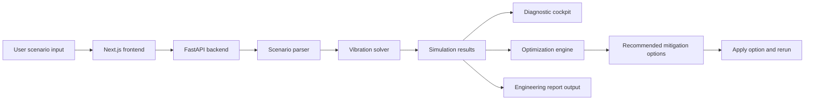

# ScenarioTwin AI

ScenarioTwin AI is a full-stack engineering diagnostic platform that converts mechanical fault scenarios into simplified simulation models, runs physics-based vibration analysis, diagnoses resonance risk, recommends safer alternatives, and generates an engineering report.

The current MVP focuses on rotating-machine vibration using a forced mass-spring-damper model.

## Demo workflow

A user enters a scenario such as:

```text
A pump with mass 30 kg vibrates at 700 RPM. The mount stiffness is 80000 N/m, damping is 300 Ns/m, and excitation force is 150 N.
```

ScenarioTwin AI then:

1. Extracts engineering parameters from the scenario text.
2. Builds a simplified vibration model.
3. Runs a backend physics simulation.
4. Calculates resonance indicators.
5. Displays a diagnostic cockpit.
6. Generates optimization recommendations.
7. Allows users to apply recommended changes and rerun the model.
8. Produces an engineering report summary.

## System architecture



## Core features

* Natural-language scenario parsing
* Interactive model controls
* Independent control runs
* FastAPI backend
* Python vibration solver
* Forced mass-spring-damper simulation
* Resonance risk classification
* Frequency-ratio analysis
* Peak displacement prediction
* Optimization recommendations
* Apply-option decision loop
* Recharts displacement response graph
* Auto-generated engineering report
* GitHub-ready full-stack project structure

## Engineering model

The first module uses a single-degree-of-freedom forced vibration model.

Inputs:

* Mass, in kg
* Mount stiffness, in N/m
* Damping coefficient, in Ns/m
* Excitation force, in N
* Operating speed, in RPM

Computed outputs:

* Natural frequency
* Forcing frequency
* Damping ratio
* Frequency ratio
* Peak displacement
* Steady-state amplitude
* Resonance risk level

## Optimization logic

The optimization engine tests alternative operating and design conditions, including:

* Modified mount stiffness
* Increased damping
* Shifted operating speed

The alternatives are ranked by lowest simulated peak displacement. Users can apply a recommended option directly, causing the frontend controls, diagnostic cockpit, displacement graph, and report output to update.

## Tech stack

### Frontend

* Next.js
* React
* TypeScript
* Tailwind CSS
* Recharts

### Backend

* FastAPI
* Python
* SciPy
* NumPy
* Pydantic

## Project structure

```text
scenariotwin-ai/
├── backend/
│   ├── main.py
│   ├── requirements.txt
│   └── simulation/
│       └── vibration_solver.py
│
├── frontend/
│   ├── app/
│   │   ├── page.tsx
│   │   ├── layout.tsx
│   │   └── globals.css
│   ├── package.json
│   └── tsconfig.json
│
├── .gitignore
└── README.md
```

## Running locally

### 1. Start the backend

```powershell
cd backend
.\.venv\Scripts\Activate.ps1
uvicorn main:app --reload
```

Backend:

```text
http://127.0.0.1:8000
```

API documentation:

```text
http://127.0.0.1:8000/docs
```

### 2. Start the frontend

```powershell
cd frontend
npm.cmd run dev
```

Frontend:

```text
http://localhost:3000
```

## Main API endpoints

### Health check

```text
GET /
```

Returns backend status.

### Interpret scenario

```text
POST /interpret/scenario
```

Extracts model parameters from natural-language scenario text.

### Run vibration simulation

```text
POST /simulate/vibration
```

Runs the forced vibration model.

### Optimize vibration setup

```text
POST /optimize/vibration
```

Tests alternative stiffness, damping, and operating-speed settings, then ranks options by lowest simulated peak displacement.

## Example use case

Default near-resonance scenario:

```text
A rotating machine vibrates heavily at 480 RPM. The mount feels unstable and the vibration increases near operating speed.
```

Typical result:

* Natural frequency near forcing frequency
* Frequency ratio close to 1
* High resonance risk
* Large peak displacement
* Mitigation options suggested by the optimizer

## Current MVP status

Implemented:

* Full-stack frontend/backend architecture
* Local physics simulation engine
* Natural-language parameter extraction
* Interactive sliders
* Independent control runs
* Resonance diagnostic cockpit
* Optimization recommendations
* Apply-option rerun workflow
* Engineering report output
* Git version control
* GitHub repository

Planned improvements:

* More robust AI-based scenario interpretation
* Additional solver modules
* PDF report export
* Better optimization constraints
* Deployment
* Demo screenshots and video
* More detailed validation examples

## Disclaimer

This project is an educational engineering simulation tool. The current model is intentionally simplified and should not be used for real-world safety-critical design decisions without professional validation.

## Live Demo

- Web app: https://scenariotwin-ai.vercel.app
- API health check: https://scenariotwin-ai.vercel.app/api/

